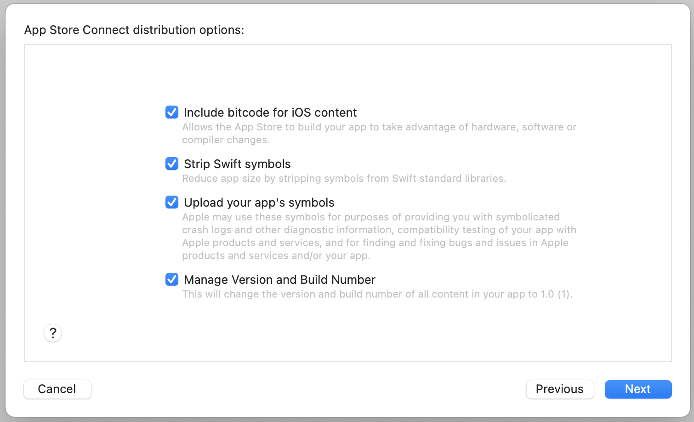

# How much larger does an iOS app become when you add the ably-cocoa SDK?

This aims to find out how much the [ably-cocoa SDK](https://github.com/ably/ably-cocoa) contributes to the size of an iOS app.

## Units

Here, "kB" means [kilobyte](https://en.wikipedia.org/wiki/Kilobyte) and "MB" means [megabyte](https://en.wikipedia.org/wiki/Megabyte).

## Findings

Adding version 1.2.10 of the ably-cocoa SDK to an iOS app adds, at most:

- between 298kB and 660kB to the app’s App Store download size
- between 630kB and 813kB to the app’s installed size

The exact value within that range depends upon which device the app is being installed on.

We say "at most" because this value includes ably-cocoa's dependencies. If the app is already has some dependencies in common with ably-cocoa (which is unlikely given the specific nature of ably-cocoa's dependencies) then this value will be lower.

The App Store download size increase is in fact still an estimate, as described by Apple (see the App Store Connect documentation linked in [Methodology](#methodology)):

> Note: When your app is approved for the App Store, it is encrypted with DRM and recompressed. The added encryption and DRM affects the ability to compress your binary, and as a result you may see a larger App Store file size for your binary than the binary you uploaded in App Store Connect. The exact final size for your app cannot be determined in advance to the accuracy of a single byte.

## Methodology

I created a sample iOS app, which can be found in this repo. I then created a branch, `with-ably`, and added the Swift package ably-cocoa v1.2.10 as a dependency.

I then used Xcode 13.4.1 to create an Archive build from each of these branches, and used Xcode to upload them to the App Store using the following settings:

I then used App Store Connect’s ["View builds and build metadata" functionality](https://help.apple.com/app-store-connect/#/dev3b56ce97c) (see "View the file sizes of a build" on the linked page) to gather information about the estimated size of the app.

[According to Apple](https://developer.apple.com/documentation/xcode/reducing-your-app-s-size), this is the most accurate way to estimate an app’s App Store size:

> (…) if your app is available through the App Store or the TestFlight app, App Store Connect provides the most accurate size information.

## Data

- The "without Ably" data is for commit `7cd4a9c` of this repo.
- The "with Ably" data is for commit `b7167f8` of this repo.

<table>
  <thead>
    <tr>
      <th rowspan="2">Device type</th>
      <th colspan="3">Download size</th>
      <th colspan="3">Install size</th>
    </tr>
    <tr>
      <td>Without Ably</td>
      <td>With Ably</td>
      <td>Increase</td>
      <td>Without Ably</td>
      <td>With Ably</td>
      <td>Increase</td>
    </tr>
  </thead>
  <tbody>
    <tr>
      <td>Universal</td>
      <td>5.23 MB</td>
      <td>6.44 MB</td>
      <td>1.21 MB</td>
      <td>14.0 MB</td>
      <td>15.5 MB</td>
      <td>1.5 MB</td>
    </tr>
    <tr>
      <td>iPad (4th generation)</td>
      <td>2.73 MB</td>
      <td>3.29 MB</td>
      <td>560 kB</td>
      <td>6.45 MB</td>
      <td>7.09 MB</td>
      <td>640 kB</td>
    </tr>
    <tr>
      <td>iPad (4th generation) Wi‑Fi + Cellular</td>
      <td>2.73 MB</td>
      <td>3.29 MB</td>
      <td>560 kB</td>
      <td>6.45 MB</td>
      <td>7.09 MB</td>
      <td>640 kB</td>
    </tr>
    <tr>
      <td>iPad Air Wi‑Fi + Cellular</td>
      <td>2.47 MB</td>
      <td>3.13 MB</td>
      <td>660 kB</td>
      <td>7.57 MB</td>
      <td>8.38 MB</td>
      <td>810 kB</td>
    </tr>
    <tr>
      <td>iPad mini 2</td>
      <td>2.47 MB</td>
      <td>3.13 MB</td>
      <td>660 kB</td>
      <td>7.57 MB</td>
      <td>8.38 MB</td>
      <td>810 kB</td>
    </tr>
    <tr>
      <td>iPad mini 2 Wi‑Fi + Cellular</td>
      <td>2.47 MB</td>
      <td>3.13 MB</td>
      <td>660 kB</td>
      <td>7.57 MB</td>
      <td>8.38 MB</td>
      <td>810 kB</td>
    </tr>
    <tr>
      <td>iPad mini 3</td>
      <td>2.47 MB</td>
      <td>3.13 MB</td>
      <td>660 kB</td>
      <td>7.57 MB</td>
      <td>8.38 MB</td>
      <td>810 kB</td>
    </tr>
    <tr>
      <td>iPad mini 3 Wi‑Fi + Cellular</td>
      <td>2.47 MB</td>
      <td>3.13 MB</td>
      <td>660 kB</td>
      <td>7.57 MB</td>
      <td>8.38 MB</td>
      <td>810 kB</td>
    </tr>
    <tr>
      <td>iPad Pro (12.9‑inch) (2nd generation)</td>
      <td>2.47 MB</td>
      <td>3.13 MB</td>
      <td>660 kB</td>
      <td>7.57 MB</td>
      <td>8.38 MB</td>
      <td>810 kB</td>
    </tr>
    <tr>
      <td>iPad Pro (12.9‑inch) (2nd generation) Wi‑Fi + Cellular</td>
      <td>2.47 MB</td>
      <td>3.13 MB</td>
      <td>660 kB</td>
      <td>7.57 MB</td>
      <td>8.38 MB</td>
      <td>810 kB</td>
    </tr>
    <tr>
      <td>iPad Pro (10.5‑inch)</td>
      <td>2.47 MB</td>
      <td>3.13 MB</td>
      <td>660 kB</td>
      <td>7.57 MB</td>
      <td>8.38 MB</td>
      <td>810 kB</td>
    </tr>
    <tr>
      <td>iPad Pro (10.5‑inch) Wi‑Fi + Cellular</td>
      <td>2.47 MB</td>
      <td>3.13 MB</td>
      <td>660 kB</td>
      <td>7.57 MB</td>
      <td>8.38 MB</td>
      <td>810 kB</td>
    </tr>
    <tr>
      <td>iPad (6th generation)</td>
      <td>2.47 MB</td>
      <td>3.13 MB</td>
      <td>660 kB</td>
      <td>7.57 MB</td>
      <td>8.38 MB</td>
      <td>810 kB</td>
    </tr>
    <tr>
      <td>iPad (6th generation) Wi‑Fi + Cellular</td>
      <td>2.47 MB</td>
      <td>3.13 MB</td>
      <td>660 kB</td>
      <td>7.57 MB</td>
      <td>8.38 MB</td>
      <td>810 kB</td>
    </tr>
    <tr>
      <td>iPad (7th generation) Wi‑Fi + Cellular</td>
      <td>134 KB</td>
      <td>433 KB</td>
      <td>299 kB</td>
      <td>417 KB</td>
      <td>1.22 MB</td>
      <td>803 kB</td>
    </tr>
    <tr>
      <td>iPad Pro (11‑inch)</td>
      <td>2.47 MB</td>
      <td>3.13 MB</td>
      <td>660 kB</td>
      <td>7.57 MB</td>
      <td>8.38 MB</td>
      <td>810 kB</td>
    </tr>
    <tr>
      <td>iPad Pro (11‑inch) Wi‑Fi + Cellular</td>
      <td>2.47 MB</td>
      <td>3.13 MB</td>
      <td>660 kB</td>
      <td>7.57 MB</td>
      <td>8.38 MB</td>
      <td>810 kB</td>
    </tr>
    <tr>
      <td>iPad Pro (12.9‑inch) (3rd generation)</td>
      <td>2.47 MB</td>
      <td>3.13 MB</td>
      <td>660 kB</td>
      <td>7.57 MB</td>
      <td>8.38 MB</td>
      <td>810 kB</td>
    </tr>
    <tr>
      <td>iPad Pro (11‑inch) (2nd generation)</td>
      <td>135 KB</td>
      <td>433 KB</td>
      <td>298 kB</td>
      <td>417 KB</td>
      <td>1.22 MB</td>
      <td>803 kB</td>
    </tr>
    <tr>
      <td>iPad Pro (11‑inch) (2nd generation) Wi‑Fi + Cellular</td>
      <td>135 KB</td>
      <td>433 KB</td>
      <td>298 kB</td>
      <td>417 KB</td>
      <td>1.22 MB</td>
      <td>803 kB</td>
    </tr>
    <tr>
      <td>iPad Pro (12.9‑inch) (4th generation)</td>
      <td>135 KB</td>
      <td>433 KB</td>
      <td>298 kB</td>
      <td>417 KB</td>
      <td>1.22 MB</td>
      <td>803 kB</td>
    </tr>
    <tr>
      <td>iPad Pro (12.9‑inch) (4th generation) Wi‑Fi + Cellular</td>
      <td>135 KB</td>
      <td>433 KB</td>
      <td>298 kB</td>
      <td>417 KB</td>
      <td>1.22 MB</td>
      <td>803 kB</td>
    </tr>
    <tr>
      <td>iPad mini (5th generation)</td>
      <td>144 KB</td>
      <td>799 KB</td>
      <td>655 kB</td>
      <td>417 KB</td>
      <td>1.23 MB</td>
      <td>813 kB</td>
    </tr>
    <tr>
      <td>iPad mini (6th generation)</td>
      <td>135 KB</td>
      <td>433 KB</td>
      <td>298 kB</td>
      <td>417 KB</td>
      <td>1.22 MB</td>
      <td>803 kB</td>
    </tr>
    <tr>
      <td>iPad mini (6th generation) Wi-Fi + Cellular</td>
      <td>135 KB</td>
      <td>433 KB</td>
      <td>298 kB</td>
      <td>417 KB</td>
      <td>1.22 MB</td>
      <td>803 kB</td>
    </tr>
    <tr>
      <td>iPhone 5</td>
      <td>2.72 MB</td>
      <td>3.28 MB</td>
      <td>560 kB</td>
      <td>6.44 MB</td>
      <td>7.07 MB</td>
      <td>630 kB</td>
    </tr>
    <tr>
      <td>iPhone 5c</td>
      <td>2.72 MB</td>
      <td>3.28 MB</td>
      <td>560 kB</td>
      <td>6.44 MB</td>
      <td>7.07 MB</td>
      <td>630 kB</td>
    </tr>
    <tr>
      <td>iPhone 5S</td>
      <td>2.46 MB</td>
      <td>3.11 MB</td>
      <td>650 kB</td>
      <td>7.55 MB</td>
      <td>8.36 MB</td>
      <td>810 kB</td>
    </tr>
    <tr>
      <td>iPhone 7</td>
      <td>2.46 MB</td>
      <td>3.11 MB</td>
      <td>650 kB</td>
      <td>7.55 MB</td>
      <td>8.36 MB</td>
      <td>810 kB</td>
    </tr>
    <tr>
      <td>iPhone 7 Plus</td>
      <td>2.47 MB</td>
      <td>3.13 MB</td>
      <td>660 kB</td>
      <td>7.57 MB</td>
      <td>8.38 MB</td>
      <td>810 kB</td>
    </tr>
    <tr>
      <td>iPhone 11</td>
      <td>128 KB</td>
      <td>427 KB</td>
      <td>299 kB</td>
      <td>404 KB</td>
      <td>1.21 MB</td>
      <td>806 kB</td>
    </tr>
    <tr>
      <td>iPhone 11 Pro</td>
      <td>138 KB</td>
      <td>436 KB</td>
      <td>298 kB</td>
      <td>421 KB</td>
      <td>1.22 MB</td>
      <td>799 kB</td>
    </tr>
    <tr>
      <td>iPhone 11 Pro Max</td>
      <td>138 KB</td>
      <td>436 KB</td>
      <td>298 kB</td>
      <td>421 KB</td>
      <td>1.22 MB</td>
      <td>799 kB</td>
    </tr>
    <tr>
      <td>iPhone SE (2nd generation)</td>
      <td>121 KB</td>
      <td>419 KB</td>
      <td>298 kB</td>
      <td>396 KB</td>
      <td>1.20 MB</td>
      <td>804 kB</td>
    </tr>
    <tr>
      <td>iPhone 12 mini</td>
      <td>138 KB</td>
      <td>436 KB</td>
      <td>298 kB</td>
      <td>421 KB</td>
      <td>1.22 MB</td>
      <td>799 kB</td>
    </tr>
    <tr>
      <td>iPhone 12</td>
      <td>138 KB</td>
      <td>436 KB</td>
      <td>298 kB</td>
      <td>421 KB</td>
      <td>1.22 MB</td>
      <td>799 kB</td>
    </tr>
    <tr>
      <td>iPhone 12 Pro</td>
      <td>138 KB</td>
      <td>436 KB</td>
      <td>298 kB</td>
      <td>421 KB</td>
      <td>1.22 MB</td>
      <td>799 kB</td>
    </tr>
    <tr>
      <td>iPhone 12 Pro Max</td>
      <td>138 KB</td>
      <td>436 KB</td>
      <td>298 kB</td>
      <td>421 KB</td>
      <td>1.22 MB</td>
      <td>799 kB</td>
    </tr>
    <tr>
      <td>iPod touch (6th generation)</td>
      <td>2.46 MB</td>
      <td>3.11 MB</td>
      <td>650 kB</td>
      <td>7.55 MB</td>
      <td>8.36 MB</td>
      <td>810 kB</td>
    </tr>
  </tbody>
</table>
